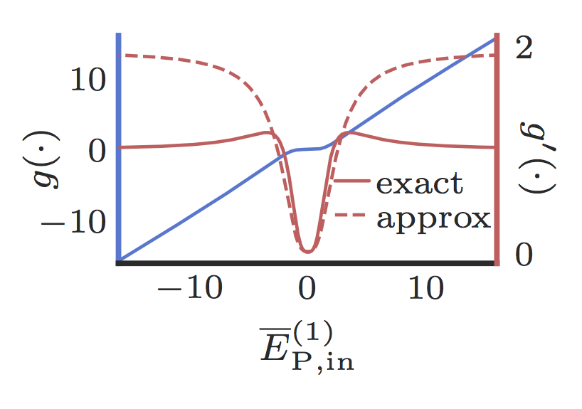
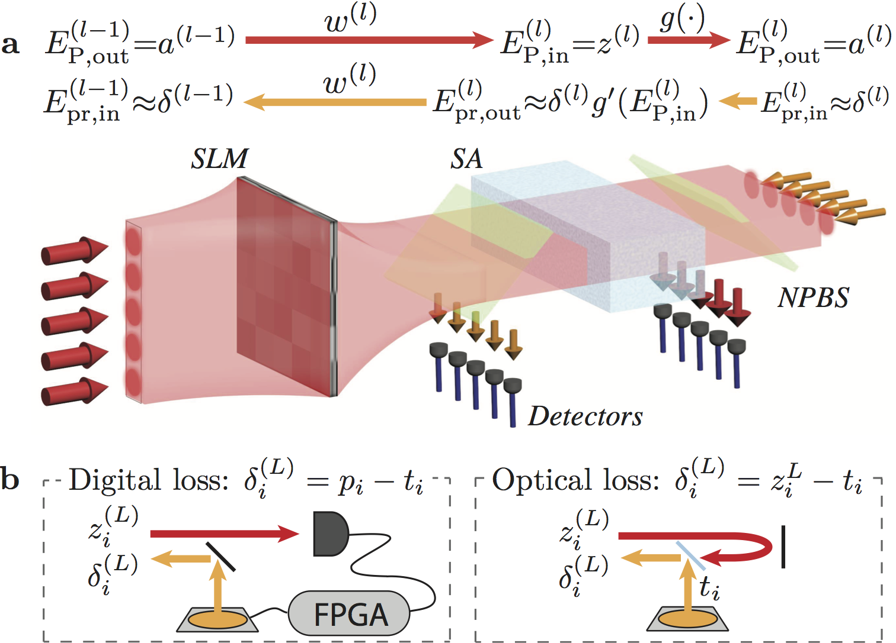
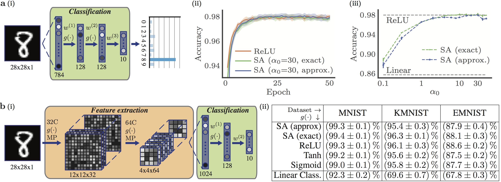

# all-optical-neural-networks

---

Supporting code for ["End-to-end optical backpropagation for training neural networks"](https://arxiv.org/abs/1912.12256).

---

## Overview

We consider an optical neural network (ONN) that uses saturable absorption (SA) to realise the nonlinaer activation functions.  A README is not the setting for equations, but in brief this system allows us to perform both forward and backward propagation in a single pass with only passive optical elements.  A rough justification for this is below, but for details please see the paper!

*How does optical backpropagation work?*

Recalling the backpropagation algorithm, obtaining the gradient of the loss function at each neuron requires multiplying the back-propagating loss with the gradient of the neuron's response to the forward-propagating signal.  SA in a pump-probe set up has a nonlinear response to the strong pump (i.e. forward propagating signal) and a weak linear response to the probe (i.e. back-propagating gradients).  Within the unsaturated (nonlinear) region of the SA response curve, this probe response is a good approximation of the gradient of the pump response (see Fig. 1), therefore it provides us with the necessary gradient backpropagation.

 

**Fig. 1:** Transmission and exact and optically approximated gradients of an SA nonlinearity with an optical depth of 10.

In this way, we can build all-optical neural networks, with information encoded in the intensity/amplitude of different electric field modes.  Linear operations can be realised in an integrated or free-space setting, with SA nonlinear units and tapped off light providing access to the forward propagating neuron inputs/activations and backwards propagating gradients (see Fig. 2).  This repository provides code to simulate the performance of these ONNs, and they are found to produce equivalent performance to computationally trained networks (ANNs) (see Fig. 3).

    

**Fig. 2:** One possible free-space implementation of a single network layer.

 

**Fig. 3:** Trained performance of ONNs vs ANNs.

## Requirements

The only significant dependency beyond standard packages found in most Python distributions (e.g. numpy, matplotlib etc) is [PyTorch](https://pytorch.org/) (the experiments were performed with version 1.2.0).   Additionally, using the [seaborn](https://seaborn.pydata.org/) library will make all your plot's nicer!

For completeness, full details of the environment used in the experiments are in the provided  [``req.txt``](misc/req.txt) file.

## Experiments

Scripts to train networks like those in the paper are provided in the [``experiments``](experiments) folder.

In general, we consider [MLPs](experiments/mlp) and [CNNs](experiments/cnn).  For each these there are two scripts, ``train_ONN.py`` and ``train_ANN.py``, for training optical networks and a computational baseline, respectively.  It is straightforward to modify the arguments of each to train various network architectures and implementations.

## Reference

If you find this work or the associated paper useful, it can be cited as below.

    @article{guo2019aonn,
      title={End-to-end optical backpropagation for training neural networks},
      author={Guo, Xianxin and Barrett, Thomas D and Whang, Zhiming M and Lvovsky, AI},
      journal={arXiv preprint arXiv:1912.12256},
      year={2019}
    }
